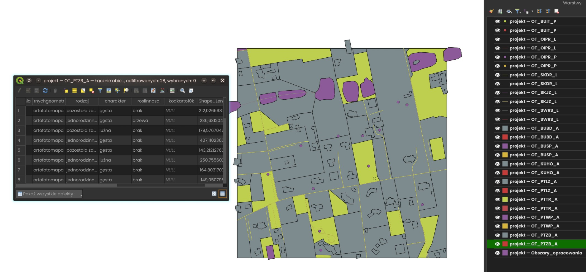

# Mapa BDOT10k

Projekt zaliczeniowy na studiach mający za zadanie stworzenie mapy obiektów topograficznych w standardzie BDOT10k na wybranym fragmencie miasta (Łódź, okolice fragmenty ul. Rogowskiej)

Aby uruchomić projekt należy pobrać to repozytorium, rozpakować archiwum i uruchomić plik: projekt.mxd (ArcMap) lub projekt.mpk (ArcMap/QGIS) 

"Szybki" screenshot:

